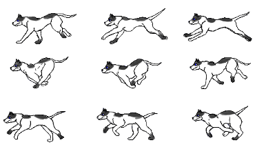
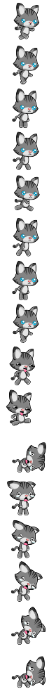
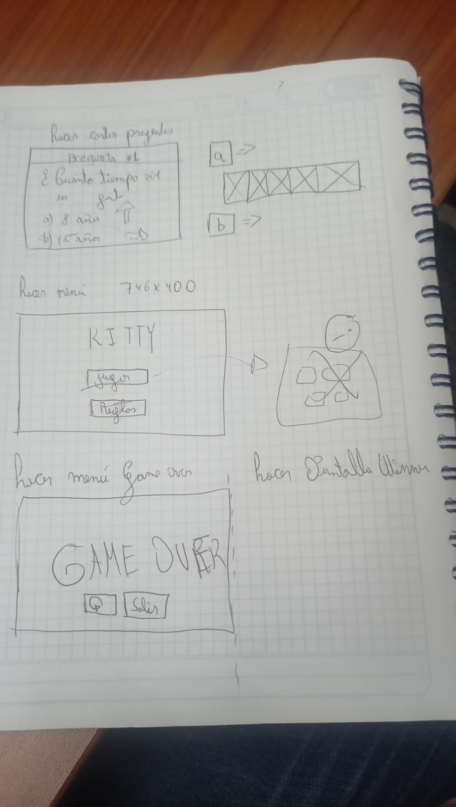
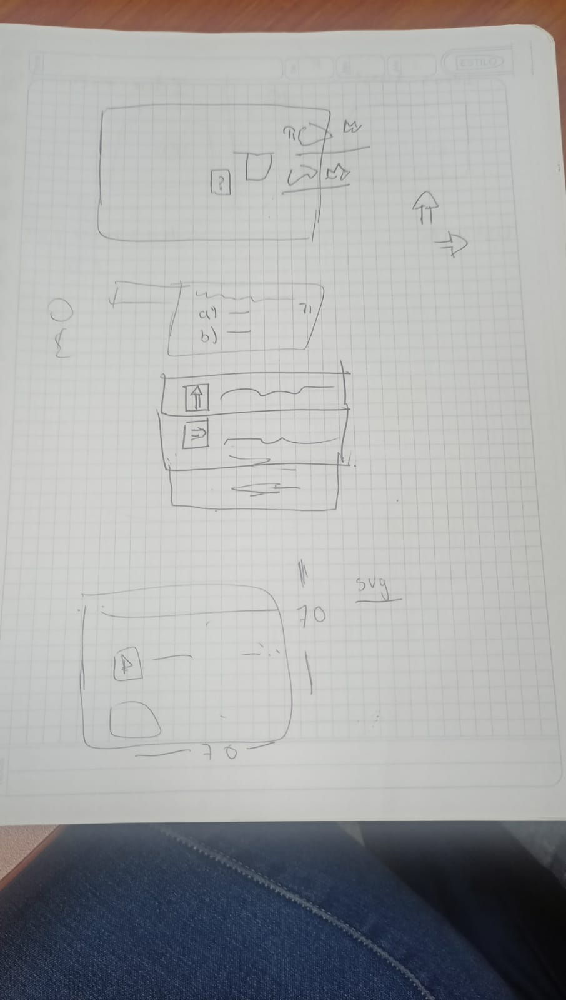
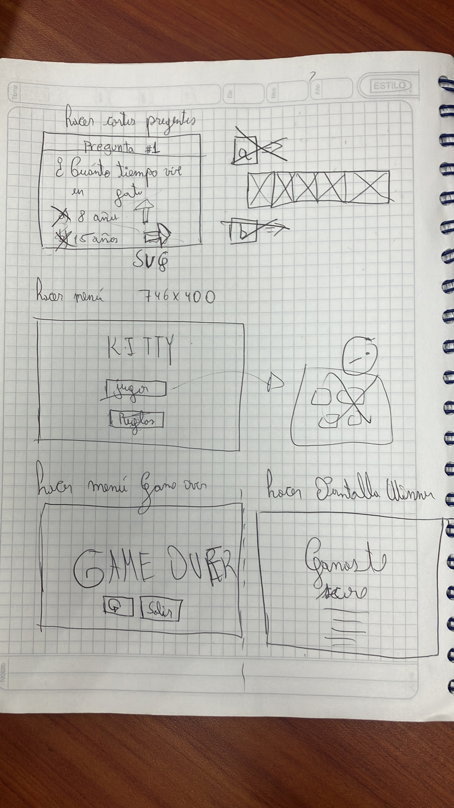
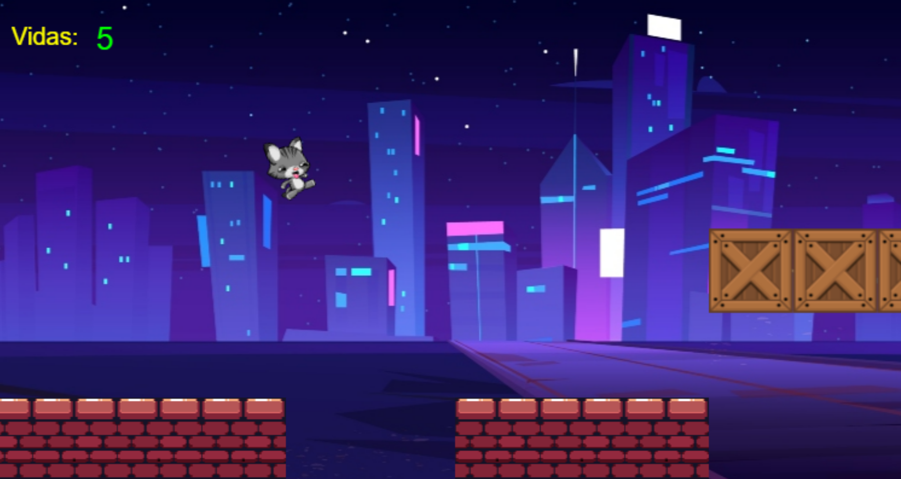
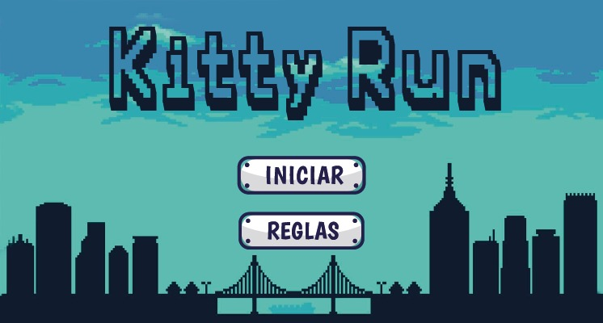
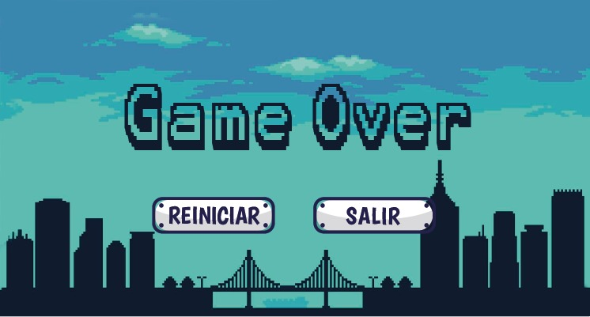
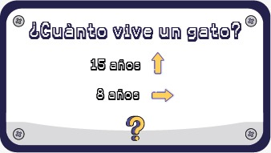

# Stray cat 

[Comienza el juego aquí](https://margaritamawyin.github.io/RunCatVJ/)

## Ideación

1. Animalito de la calle que tiene misiones para ayudar a las personas que están la calle. 

2. Animalito hambriento, en una pantalla vertical, el animal esta abajo y desde arriba caen objetos. Los cuales puede ser comida comestible o no comestible, así como cosas que no son comida. El animalito debe solo ponerse debajo de lo que si come caso contrario va perdiendo vida. 

3. Un conjunto de clubs de mascotas, en donde los dueños pueden interactuar con otros, convivir con sus otras mascotas, hacer diferentes actividades, hacer grupos.  (Tatiana Yepez) 

4. Un juego con varios niveles, de los más fáciles a los más difíciles, que consisten en el entrenamiento de un perro para que se capacite como ayudante de bomberos 

5. Un juego de computador individual en donde podrás descubrir que mascota es la ideal para ti y para tus condiciones. 

6. Un perro o gato corriendo por la calle, mientras eso, se le va presentando varios obstáculos que debe pasar, al pasarlos todos termina en un hogar 

7. El jugador es un perrito que sus misiones consisten en ayudar a realizar tareas a persona no videntes 

8. Un juego, donde hay varios jugadores conectados a un mismo link de juego, en el cual sale frases relacionadas a las mascotas. Ejemplo de frase: “Que no puede comer un perro?”. Los jugares deben enlistar el mayor número de respuestas en X tiempo.  

9. Un juego de navegador masivo, en perspectiva cenital, el cual habrá muchos personajes de personas en línea en el mapa y habrán animales abandonados al rededor del mapa que se alejan cuando un personaje se les acerca, el que rescate más animales por partida gana. 

10. Un videojuego de una ciudad de mascotas, en donde cada jugador representa un animalito, debe tomar acciones para que el animalito sobreviva en la ciudad, en esta puede haber peligros, sin embargo, deberá esquivarlos, se pueden hacer manadas para convivir y crecer la comunidad. (Tatiana Yepez) 

11. Un juego que adivina que animal estás pensando. El juego te hace preguntas que solo se pueden responder con SI/NO. 

12. Un animalito corre por un camino con obstáculos. Para mover el animalito y que esquive el obstáculo se lo hace con la mirada. 

13. En una imagen de una calle u otro lugar, se encuentran escondidos/camuflados los animalitos que hay que encontrar. Dentro de un tiempo predefinido hay que encontrar todos los animales ocultos.  

14. El juego presenta una frase y unos animalitos en un camino. Hay que tipear letra a letra la frase y el animalito va avanzando 

15. En una pantalla del celular, se presenta un camino, un perro corre de un peligro y en el camino debe moverse derecha-izquierda para esquivar obstáculos y atrapar croquetas que se le presentan en la via 

16. Un gato y 3 presas. En un escenario como la pecera, jardín, cuarto, etc, el gato trata de atrapar a las tres presas en un tiempo determinando (ej: 30seg). Las presas son otros jugadores que deben escapar del gato. Si el gato atrapa a todos en el tiempo definido, gana. 

17. Un gato debe atravesar un mapa de peligros hasta llegar al pescadito. Es juego por niveles. Con cada nivel se aumenta la dificultad.


###  Luvia de ideas

1. Un animalito corriendo por una calle
2. Un gato escapando de un peligro
3. Un gato corriendo por un camino infinito
4. Un animalito corriendo y esquivando obstáculos
5. Preguntas aparecen aleatoriamente en el camino
6. Se empieza con X vidas y se pierden si no esquiva el obstáculo
7. Objetos cayendo desde arriba
8. Alimentos comestibles y no comestible callendo desde arriba
9. Objetos peligrosos cayendo desde arriva
10. Varios animalitos escapando de un peligro
11. Saltar para esquivar obstáculos o abismos
12. Peces huyendo de un gato
13. Ratones huyendo de un gato
14. Gato huyendo de un perro
15. Preguntas cayendo de arriba, si la atrapa se presenta la pregunta contestar
16. Un animalito escapando de un laberinto
17. Animalito que se mueve derecha-izquierda y debe atrapar solo alimentos comestibles
18. Un gato o perro que se mueve de derecha o izquierda atrapa frases correctas sobre el cuidado animal
    


###  Idea seleccionada

 En una pantalla del celular, se presenta un camino, un perro corre de un peligro y en el camino debe moverse derecha-izquierda para esquivar obstáculos y atrapar croquetas que se le presentan en la via

 **A la idea se le hicieron varios cambios después de ser seleccioanda**
 1. El juego es para página web o para celular
 2. Un gato corre de un peligro, en vez de un perro.
 3. No se mueve a la derecha o a la izquiera, se mueve en una sola direccion y solo se puede saltar
 4. Los obstaculos son perros
 5. No atrapa croquetas, sino que busca responder el mayor número de preguntas.


## Seleccion de herramienta para creacion del video juego

[Phaser](https://desarrolloweb.com/articulos/introduccion-phaser) es un motor de juegos 2D realizado sobre Javascript. Es simplemente un framework o biblioteca de código Javascript que puedes incluir en tu página y mediante la cual puedes desarrollar juegos de diferentes tipos

Para instalar el framework, es tan sencillo como incluir el script con el código de Phaser, que podemos traernos incluso de un CDN.
```
<script src="//cdn.jsdelivr.net/npm/phaser@3.24.0/dist/phaser.js"></script>
```
También es posible descargar Phaser desde su página web: https://phaser.io/download/stable  o usar npm si lo prefieren.

*El único requisito* que se necesita para que Phaser funcione correctamente es usar un servidor web para arrancar el juego. Vale cualquier servidor web que pueda tener o usar habitualmente. Asegurarse que se accede al servidor donde se encuentra el juego a través de `http://` en lugar de `file://`. Este requisito se debe a que Phaser hace la carga de todas las imágenes, sonidos y recursos necesarios para mover el juego mediante *Ajax*, por lo que es necesario abrir la página a través de http, aunque vayamos a acceder a un archivo que está en nuestra propia máquina local.

## Desarrollo de idea seleccionada

####  Introducción

* Número de jugadores: 1 jugador 
* Duración aproximada del juego: 5 minutos 
* Edad mínima recomendada: 10 años 
* Tipo: Video Juegos en la Web 
* Género: Amistoso 

Stray cat es un juego para dispositivo web enfocado a fomentar el cuidado animal con cortas preguntas y 2 opciones de respuesta. Se juega de manera individual hasta perder o completar todas las preguntas.  

####  Instrucciones

Usando la barra espaciadora, debes saltar, evitando morrir mientras recorres la calle. Ten cuidado con los perros, si te tocan , pierdes 1 vida, OJO, tienes solo 5 vidas al inicio del juego. Si deseas bajar rapido, usa el boton de “abajo”. 

####  Reglas

Estas  corriendo por la calle y se te va presentar una pregunta relacionada al cuidado de mascotas, seguido tendras dos opciones de respuestas, una correcta y otra incorrecta. Deber tomar el camino donde este la respuesta correcta para continuar con el juego, caso contrario pierdes. 

####  Fin del juego

Después de contestar todas las preguntas, te encontras con un castillo. Felicidades! Has logrado escapar de la fría y peligrosa calle. 

####  Assets

     

### Prototipos de baja fidelidad

  

### Interfaz
 


### Diseños

   

## Play testing
 
**Playtesting 1**

<iframe width="560" height="315" src="https://www.youtube.com/embed/mWsCEwf6K_U" title="YouTube video player" frameborder="0" allow="accelerometer; autoplay; clipboard-write; encrypted-media; gyroscope; picture-in-picture; web-share" allowfullscreen></iframe>


**Playtesting 2**

<iframe width="560" height="315" src="https://www.youtube.com/embed/qZaPg4RkT8A" title="YouTube video player" frameborder="0" allow="accelerometer; autoplay; clipboard-write; encrypted-media; gyroscope; picture-in-picture; web-share" allowfullscreen></iframe>


## Manual de usuario


 


